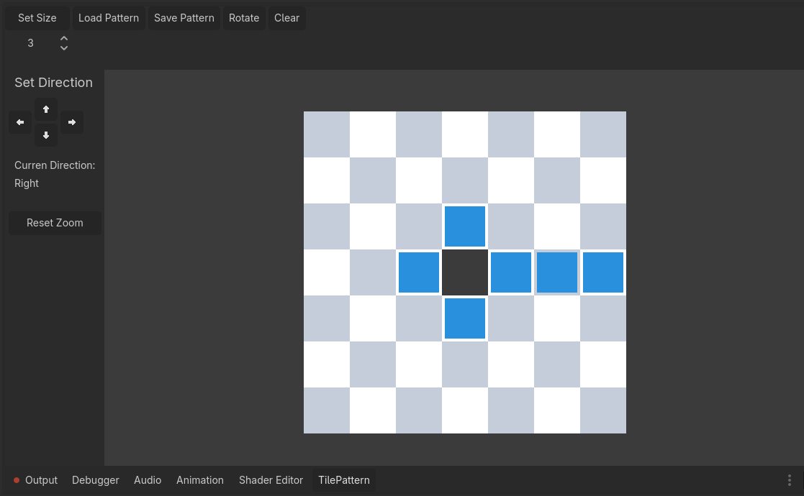

# Tile Pattern Editor Addon for Godot

This addon adds a simple Tile Pattern Editor to the Godot Editor, enabling the creation and manipulation of tile patterns for use in tile-based games or systems.

Store patterns as Vector2i arrays in a custom TilePatternResource.
TilePatternResource supports rotation and directional handling procrammatically or through the edior.

## Installation

1. Download or clone the repository.
2. Copy the addons folder into your Godot project.
3. In the Godot Editor, go to Project -> Project Settings -> Plugins.
4. Enable the Tile Pattern Editor plugin from the list.

## Usage

Once the addon is enabled, you'll have access to the Tile Pattern Editor in the Godot Editor. To create a new pattern:

Open the Tile Pattern Editor (should be at the Bottom) and start drawing your pattern.
Rotate and set the direction of the pattern using the UI controls or programmatically within your game code.

There is an simple example scene of how to load and maybe use the patterns.

## API Overview
TilePatternResource

A custom resource used to store and manipulate tile patterns. Patterns are stored as an array of Vector2i positions representing tile coordinates.#
The pattern rotates around (0, 0), which represents the pattern's anchor/origin. The origin itself may or may not be part of the pattern.

### Properties:
* **pattern**: Array[Vector2i]: The current array of tile positions.
* **current_direction**: Direction: The direction the pattern is currently facing (Right, Up, Left, Down).

### Methods:

Returns what the pattern would look like if rotated to the target_direction, without modifying the current state.
* **get_pattern_for_direction(target_direction: Direction) -> Array[Vector2i]**: 

Checks if a position is inside the pattern.
* **contains(offset: Vector2i, direction: Direction = current_direction) -> bool:** 

Returns a bounding box for the pattern.
* **func get_bounds(direction: Direction = current_direction) -> Rect2i:**

 Returns cells that are inside the pattern originating from a position.
* **func get_cells_at(origin: Vector2i = Vector2i(0,0), direction: Direction = current_direction) -> Array[Vector2i]:**

Rotates the pattern by 90 degrees clockwise or counterclockwise.
* **rotate_by_90(clockwise: bool = true) -> Array[Vector2i]:** 

Returns the current pattern rotated to its current direction.
* **get_current_pattern_state() -> Array[Vector2i]:** 

## Inspiration

Games like Arknights, The Hundred Line, Into the breach or Final Fantasy Tactics

## License
This project is licensed under the MIT License.
